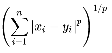

% Data mining notes
% Arianna Masciolini
Sources:

- _Introduction to data mining_ (Tan, Steinbach, Kumar): introduction and chapters I, IV, VI

# Introduction

## KDD

We refer to the conversion of raw data into useful information/patterns with the acronym __KDD__ (Knowledge Discovery in Databases).
This process consists of three main steps:

1. __input data preprocessing__: raw data is converted into a format appropriate for analysis (common preprocessing tasks examples: _feature selection_, _dimensionality reduction_, _normalization_ and _data subsetting_); 
2. actual __data mining__ (the main data mining tasks will be discussed later on);
3. __data postprocessing__, e.g. _filtering_, _visualization_ and _pattern interpretation_.

### Data mining tasks
Data mining tasks are divided into two general categories:

- Predictive tasks, such as __predictive modeling__, that is building a model for a target variable as a function of explanatory variables. Predictive modeling is called _classification_ when it deals with discrete targets, _regression_ when the targets are continuous;
- descriptive tasks, such as:
  
  - __association analysis__, which consists in discovering strongly associated features in the data,
  - __cluster analysis__, that is seeking groups of closely related observations,
  - __anomaly detection__.

# Data
The type and the quality of the data are important for successful data mining. Also, raw data often have to be preprocessed so that thay better fit a specific data mining technique. 
A __data set__ is a collection of _data objects_ or _records_ described by a number of _attributes_. An __attribute__ is a property of a data object that may vary from one sample to another and from one time to another, associated to numerical or symbolic values by a a _measurement scale_.

## Types of data
As the values used to represent an attribute may have properties that are not the properties of the attribute itself (and vice versa), many different types of measurement scale (aka types of attributes) exist. Of course, the digital representation of an attribute is intrinsically numerical, so a good way to specify the type of an attribute is to identify the properties of numbers that correspond to to underlying properties of the attribute. Some of those are:

1. distinctness,
2. order,
3. addition (+ and -),
4. multiplication (* and /).

Given these properties of numbers, we can define four types of attributes, divided in two categories, that can also be described in terms of _permissible transformations_, i.e. transformations that don't change the meaning of the attribute itself: 

| Category | Attribute type | Meaningful properties | Permissible transformations | Examples |
|:---:|:---:|:---:|:---:|:---:|
| categorical/qualitative | __nominal__ | 1 | any one-to one mapping | id numbers |
| categorical/qualitative | __ordinal__ | 1,2 | an order-preserving change of values | grades |
| numeric/quantitative | __interval__ | 1, 2, 3 | newvalue = a*oldvalue + b, where _a_ and _b_ are constants | temperatures |
| numeric/quantitative | __ratio__ | 1, 2, 3, 4 | newvalue = a*oldvalue (change of unit) | time, lengths |

We can also describe attributes in terms of the number of values they can take, so that we divide them into:

- __discrete__ attributes, that have a finite or countably finite set of possible values;
- __continuous__ attributes, whose values are real numbers.

## Data sets
The main characteristics of a data set are the following:

- __dimensionality__: number of attributes of the data objects;
- __sparsity__, which leads to significant savings in computation time and storage; 
- __resolution__: it is important that the level of resolution is not too fine nor coarse, as patterns may vary depending on it.

### Types of data sets
It is convenient to distinguish three groups of data set types: __record data__, __graph-based data__ and __ordered data__.

#### Record data
Much data mining work assumes that the data set consists in a collection of data objects, each of which has a fixed set of attributes. This kind of data is called _record data_ and is usually stored in flat files or relational databases. In the latter case, anyway, the database just serves as a convenient place to find records, as data mining often doesn't make use of all the additional information the database structure provides. 
As the fact relational databases are often used to store record data suggests, we can imagine the corresponding kind of data sets as _m_ by _n_ matrices (__data matrices__), where there is one row for each object and one column for each attribute, or vice versa. Data matrices are an interesting variation of record data, because with this representation standard matrix operations can be applied to manipulate the data. 
A special type of record data is __transaction data__, where each record or transaction involves a _set_ of items. A good example of a data object in a record data set are the products in a person's "market basket": that's why such collections of sets of items are also called __market basket data__.

#### Graph-based data
There are two kinds of graph based data:

- data sets where the graph captures relationships among different data objects;
- data sets where the data objects themselves are represented as graphs. This is convenient when such objects are structured, i.e. they contain subobjects that have significant relationships.

#### Ordered data
For some types of data, the attributes have relationships that involve temporal or spatial order:

- sequential or __temporal data__: record data where each record has a timestamp associated with it. A special kind of temporal data is __time series data__, where each record consists of a series of measurements taken over time;
- __sequence data__: same as temporal data, with positions in an ordered sequence instead of timestamps;
- __spatial data__, distributed on a two or three dimensional grid.

## Data quality
Data mining usually can't rely on optimal data sets, as data was often collected for other purpose, so it focuses on the detection and correction of data quality problems (__data cleaning__) and on the use of __algorithms that can tolerate poor data quality__-.
Data quality issues that often need to be addressed include both the presence of noise and outliers and missing, inconsistent, duplicate, biased or otherwise unrepresentative data.

## Data preprocessing
This section will cover the most important data preprocessing approaches and the interrelationships among them.

### Aggregation
Aggregating data means combining multiple records (or attributes) into a single data object (or attribute). 
Even though a disadvantage of aggregation is the potential loss of interesting details, there are a few motivations for aggregation:

- aggregation means data reduction: small data sets require less memory and processing time, so that more expensive data mining algorithms can be applied;
- aggregation can act as a change of scale, providing a higher-level view of the data;
- the behavior of groups of objects is often more stable than that of individual the individual ones.

### Sampling
Sampling is a commonly used approach for selecting a subset of the data objects to be analyzed. It's useful both for statisticians, when _obtaining_ the entire data set is too expensive, and data miners, when the existing data set is too large to be entirely _processed_.
The key point is that using a representative sample, i.e. a sample that has approximately the same properties of interest as the original data set, instead of the entire data set will work almost equally well. 
The essential approaches to sampling are the following:

- __simple random sampling__: equal probability of selecting any particular item. It can be done with or without replacement (in the former case, objects are not removed from the population as they're selected for the sample, thus the probability of choosing any object _remains_ constant);
- __stratified sampling__: this comes in handy when the population consists of different types of objects, each with a widely different number of objects, because in this case simple random sampling can fail to adequately represent the less frequent types objects. With the most basic stratified sampling technique, equal numbers of objects are drawn from each group, while in another variation the number of objects drawn from each group is proportional to the size of the group itself.

Determining the proper sample size is sometimes difficult, so _progressive_ (aka _adaptive_) schemes are used in such cases. They start with a small sample and increase its size until a it is large enough.

### Dimensionality reduction
High-dimensional data are extremely difficult to analyze, so that the preprocessing step frequently involves dimensionality reduction. Its main purpose is to avoid the so-called "curse of dimensionality": when dimensionality increases, data become increasingly sparse, occupying way too much space. The most common techniques for dimensionality reduction, based on linear algebra, are:

- __PCA__ (Principal Components Analysis), that finds new attributes, called _principal components_ that:
  - are linear combinations of the original ones,
  - are orthogonal to each other,
  - capture the maximum amount of variation in the data; 
- __SVD__ (Singular Values Decomposition);
- __ISOMAP__.

### Feature subset selection
Another way to reduce dimensionality is to simply remove redundant or irrelevant features. The brute-force approach, i.e. trying all possible subsets of features as input to the chosen data mining algorithm an then take the subset that produces the best results, is impractical in most situations, so that three standard approaches have been developed:

- __embedded__: feature selection occurs naturally as part of the data mining algorithm;
- __filter__: features are selected before the data mining algorithm is run, using an approach that is independent of the data mining task;
- __wrapper__: the target data mining algorithm is used as a black box to select the significant features, without enumerating all possible subsets.

### Feature creation
Feature creation consists in the creation of a new set of attributes that captures the important information in a more efficient way than the original one. Next, three methodologies for feature creation are described:

- __feature extraction__, highly domain-specific;
- __mapping data to a new space__;
- __feature construction__.

### Discretization and binarization
Discretization and binarization are used when the chosen data mining algorithm requires data in the form of categorical attributes.

### Attribute transformation
The term refers to a function that maps the entire set of values of a given attribute to a new set of replacement values. Two important types of such transformations are:
- __simple functions__ (a simple mathematical function is applied to each value individually); 
- __normalization__ (aka __standardization__), where the goal is to make an entire set of values satisfy a particular property.

## Proximity measures
Informally, __similarity__ can be defined as a numerical measure of the degree to which two data objects are alike They are often defined or transformed to fall in the interval [0, 1]. Likewise, __dissimilarity__ measures the degree to which the two objects are different. The term _proximity_ refers to a similarity or dissimilarity.
The proximity of objects with _n_ attributes is typically defined by combining the proximities of individual attributes, thus we first discuss proximity between objects having a single attribute (see table).

| Attribute type | Dissimilarity (d) | Similarity (s) |
|:---:|:---:|:---:|
| Nominal | 0 if x = y, 1 otherwise | 1 if x = y, 0 otherwise | 
| Ordinal | abs(x - y)/(n - 1) | 1 - d |
| Interval/ratio | (abs(x - y)) | -d (...) |

### Distances
A _distance_ or _metric_ _d_ between two objects _x_ and _y_ is a dissimilarity that satisfies the following properties:

- d(x, y) >= 0 for all x, y and d(x, y) = 0 only if x = y (__positivity__);
- d(x, y) = d(y, x) for all x, y (__symmetry__);
- d(x, z) <= d(x, y) + d(y, z) for all x, y, z (__triangle inequality__).

(NB: positivity and symmetry typically hold for similarities, too.)

#### Euclidean distance
The Euclidean distance between two objects _p_ and _q_, y is given by the following formula:

where _n_ is the number of dimensions.

#### Minkowski distance
The Minkowski distance, a generalization of the Euclidean distance between two objects _x_ and _y_, is defined as follows:

where _n_ is still the number of dimensions and _p_ is a parameter.

#### Mahalanobis distance
Descriptive statistics provides a relative measure of a some data points distance from a common point, which is unitless and scale-invariant, and takes into account the correlations of the data set: the Mahalanobis distance.

### Other examples of proximity measures

#### Similarity measures between binary vectors
If _x_, _y_ only have binary attributes, there are two common proximity measures to choose from:

- __SMC__ (Simple Matching Coefficient) = (M11 + M00) / (M00 + M01 + M10 + M11);
- __J__ (Jaccard coefficient) = M11 / (M01 + M10 + M11)

where MXY = | attributes where _x_ was x and _y_ was y |.

#### Cosine similarity
Some documents are often represented as vectors, where each attribute represents the number of occurrences of a particular term in the text. The normalizations used for documents preserve sparsity. Thus, an appropriate similarity measure, just like the Jaccard coefficient, should not depend on the number of shared 0 values, as two completely different documents are likely to "not contain" many of the same words, but also must be able to handle non-binary vectors. The cosine similarity, defined next, is one of the most common proximity measures with these characteristics:

where the numerator is the dot product between the two vectors.

#### Tanimoto coefficient (extended Jaccard)
Generalization of Jaccard coefficient for non-binary vectors:

#### Correlation
Correlation measures the linear relationship between objects. To compute correlation, we standardize the data objects _x_ and _y_ and take their dot product.

### Combining similarities for heterogeneous attributes
All previous definitions of similarities assume all attributes are of the same type. Thus, a general approach is needed.
The straightforward one is to compute similarities between each attribute separately and then combine them. It is possible to use weights when some attributes are more important than others to the definition of general proximity.

