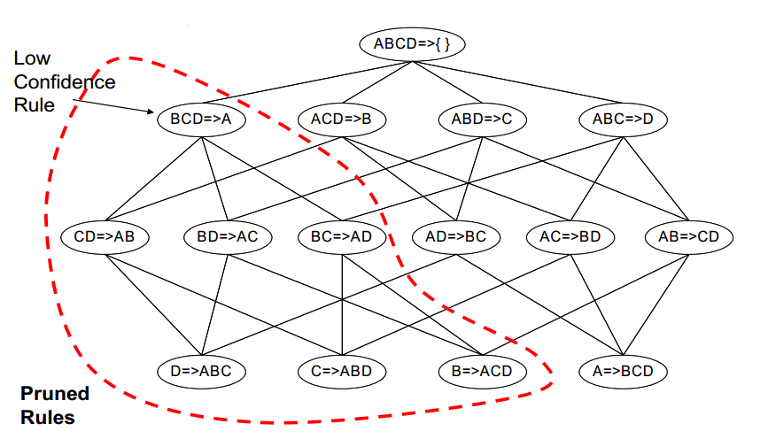

% Data mining notes
% Arianna Masciolini

Sources:

- _Introduction to data mining_ (Tan, Steinbach, Kumar): introduction and chapters I, IV, VI

# Introduction

## KDD

We refer to the conversion of raw data into useful information/patterns with the acronym __KDD__ (Knowledge Discovery in Databases).
This process consists of three main steps:

1. __input data preprocessing__: raw data is converted into a format appropriate for analysis (common preprocessing tasks examples: _feature selection_, _dimensionality reduction_, _normalization_ and _data subsetting_); 
2. actual __data mining__ (the main data mining tasks will be discussed later on);
3. __data postprocessing__, e.g. _filtering_, _visualization_ and _pattern interpretation_.


### Data mining tasks
Data mining tasks are divided into two general categories:

- Predictive tasks, such as __predictive modeling__, that is building a model for a target variable as a function of explanatory variables. Predictive modeling is called _classification_ when it deals with discrete targets, _regression_ when the targets are continuous;
- descriptive tasks, such as:
  
  - __association analysis__, which consists in discovering strongly associated features in the data,
  - __cluster analysis__, that is seeking groups of closely related observations,
  - __anomaly detection__.


# Data
The type and the quality of the data are important for successful data mining. Also, raw data often have to be preprocessed so that they better fit a specific data mining technique. 
A __data set__ is a collection of _data objects_ or _records_ described by a number of _attributes_. An __attribute__ is a property of a data object that may vary from one sample to another and/or from one time to another, associated to numerical or symbolic values by a a _measurement scale_.

## Types of data
As the values used to represent an attribute may have properties that are not the properties of the attribute itself (and vice versa), many different types of measurement scale (aka types of attributes) exist. Of course, the digital representation of an attribute is intrinsically numerical, so a good way to specify the type of an attribute is to identify the properties of numbers that correspond to to underlying properties of the attribute. Some of those are:

1. distinctness,
2. order,
3. addition ($+$ and $-$),
4. multiplication ($\times$ and $\div$).

Given these properties of numbers, we can define four types of attributes, divided into two categories, that can also be described in terms of _permissible transformations_, i.e. transformations that don't change the meaning of the attribute itself: 

| Category | Attribute type | Meaningful properties | Permissible transformations | Examples |
|:---:|:---:|:---:|:---:|:---:|
| categorical/qualitative | __nominal__ | 1 | any one-to one mapping | id numbers |
| categorical/qualitative | __ordinal__ | 1,2 | an order-preserving change of values | grades |
| numeric/quantitative | __interval__ | 1, 2, 3 | $newvalue = a \times oldvalue + b$, where $a$ and $b$ are constants | temperatures |
| numeric/quantitative | __ratio__ | 1, 2, 3, 4 | $newvalue = a \times oldvalue$ (change of unit) | time, lengths |

We can also describe attributes in terms of the number of values they can take, so that we divide them into:

- __discrete__ attributes, that have a finite or countably finite set of possible values;
- __continuous__ attributes, whose values are real numbers.


## Data sets
The main characteristics of a data set are the following:

- __dimensionality__: number of attributes of the data objects;
- __sparsity__; 
- __resolution__(it is important that the level of resolution is not too fine nor coarse, as patterns may vary depending on it).

### Types of data sets
It is convenient to distinguish three groups of data set types: __record data__, __graph-based data__ and __ordered data__.

#### Record data
Much data mining work assumes that the data set consists in a collection of data objects, each of which has a fixed set of attributes. This kind of data is called _record data_ and is usually stored in flat files or relational databases. In the latter case, anyway, the database just serves as a convenient place to find records, as data mining often doesn't make use of all the additional information the database structure provides. 
As the fact relational databases are often used to store record data suggests, we can imagine the corresponding kind of data sets as _m_ by _n_ matrices (__data matrices__), where there is one row for each object and one column for each attribute, or vice versa. Data matrices are an interesting variation of record data, because with this representation standard matrix operations can be applied to manipulate the data. 
A special type of record data are __transaction data__, where each record or transaction involves a _set_ of items. A good example of a data object in a transaction data set is the set of products in a person's "market basket": that's why such collections of sets of items are also called __market basket data__.

#### Graph-based data
There are two kinds of graph based data:

- data sets where the graph captures relationships among different data objects;
- data sets where the data objects themselves are represented as graphs. This is convenient when such objects are structured, i.e. they contain subobjects that have significant relationships.

#### Ordered data
For some types of data, the attributes have relationships that involve temporal or spatial order:

- sequential or __temporal data__: record data where each record has a timestamp associated with it. A special kind of temporal data is __time series data__, where each record consists of a series of measurements taken over time;
- __sequence data__: same as temporal data, with positions in an ordered sequence instead of timestamps;
- __spatial data__, distributed on a two or three dimensional grid.


## Data quality
Data mining usually can't rely on optimal data sets, as data is often collected for other purposes, so it focuses on the detection and correction of data quality problems (__data cleaning__) and on the use of __algorithms that can tolerate poor data quality__.
Data quality issues that often need to be addressed include both the presence of noise and outliers and missing, inconsistent, duplicate, biased or otherwise unrepresentative data.

## Data preprocessing
This section will cover the most important data preprocessing approaches and the interrelationships among them.

### Aggregation
Aggregating data means combining multiple records (or attributes) into a single data object (or attribute). 
Even though a disadvantage of aggregation is the potential loss of interesting details, there are a few motivations for aggregation:

- aggregation means data reduction: small data sets require less memory and processing time, so that more expensive data mining algorithms can be applied;
- aggregation can act as a change of scale, providing a higher-level view of the data;
- the behavior of groups of objects is often more stable than that of individual the individual ones.

### Sampling
Sampling is a commonly used approach for selecting a subset of the data objects to be analyzed. It's useful for both statisticians, when _obtaining_ the entire data set is too expensive, and data miners, when the existing data set is too large to be entirely _processed_.
The key point is that using a representative sample, i.e. a sample that has approximately the same properties of interest as the original data set, instead of the entire data set will work almost equally well. 
The essential approaches to sampling are the following:

- __simple random sampling__: equal probability of selecting any particular item. It can be done with or without replacement (in the former case, objects are not removed from the population as they're selected for the sample, thus the probability of choosing any object _remains_ constant);
- __stratified sampling__: this comes in handy when the population consists of different types of objects, each type with a widely different number of objects, because in this case simple random sampling can fail to adequately represent the less frequent types of objects. With the most basic stratified sampling technique, equal numbers of objects are drawn from each group, while in another variation the number of objects drawn from each group is proportional to the size of the group itself.

Determining the proper sample size is sometimes difficult, so _progressive_ (aka _adaptive_) schemes are used in such cases. They start with a small sample and increase its size until it's large enough.

### Dimensionality reduction
High-dimensional data are extremely difficult to analyze, so that the preprocessing step frequently involves dimensionality reduction. Its main purpose is to avoid the so-called "curse of dimensionality": when dimensionality increases, data become increasingly sparse, occupying way too much space. The most common techniques for dimensionality reduction, based on linear algebra, are:

- __PCA__ (Principal Components Analysis), that finds new attributes, called _principal components_ that:
  - are linear combinations of the original ones,
  - are orthogonal to each other,
  - capture the maximum amount of variation in the data; 
- __SVD__ (Singular Values Decomposition);
- __ISOMAP__.

### Feature subset selection
Another way to reduce dimensionality is to simply remove redundant or irrelevant features. The brute-force approach, i.e. trying all possible subsets of features as input to the chosen data mining algorithm an then take the subset that produces the best results, is impractical in most situations, so that three standard approaches have been developed:

- __embedded__: feature selection occurs naturally as part of the data mining algorithm;
- __filter__: features are selected before the data mining algorithm is run, using an approach that is independent of the data mining task;
- __wrapper__: the target data mining algorithm is used as a black box to select the significant features, without enumerating all possible subsets.

### Feature creation
Feature creation consists in the creation of a new set of attributes that captures the important information in a more efficient way than the original one. The most common methodologies for feature creation are:

- __feature extraction__, highly domain-specific;
- __mapping data to a new space__;
- __feature construction__.


### Discretization and binarization
Discretization and binarization are used when the chosen data mining algorithm requires data in the form of categorical attributes.

### Attribute transformation
The term refers to a function that maps the entire set of values of a given attribute to a new set of replacement values. Two important types of such transformations are:
- __simple functions__ (a simple mathematical function is applied to each value individually); 
- __normalization__ (aka __standardization__), where the goal is to make an entire set of values satisfy a particular property.


## Proximity measures
Informally, __similarity__ can be defined as a numerical measure of the degree to which two data objects are alike They are often defined or transformed to fall in the interval $[0, 1]$. Likewise, __dissimilarity__ measures the degree to which the two objects are different. The term _proximity_ refers to a similarity or dissimilarity.
The proximity of objects with $n$ attributes is typically defined by combining the proximities of individual attributes, thus we first discuss proximity between objects having a single attribute (see table).

| Attribute type | Dissimilarity (d) | Similarity (s) |
|:---:|:---:|:---:|
| Nominal | $0$ if $x = y$, $1$ if $x \neq y$ | $1$ if $x = y$, $0$ if $x \neq y$ | 
| Ordinal | $\frac{abs(x - y)}{(n - 1)}$ | $1 - d$ |
| Interval/ratio | $abs(x - y)$ | $-d$ |

### Distances
A _distance_ or _metric_ $d$ between two objects $x$ and $y$ is a dissimilarity that satisfies the following properties:

- $d(x, y) \geq 0 \forall x, y \wedge  d(x, y) = 0 \rightarrow  x = y$ (__positivity__);
- $d(x, y) = d(y, x) \forall x, y$ (__symmetry__);
- $d(x, z) \geq d(x, y) + d(y, z) \forall x, y, z$ (__triangle inequality__).

(NB: positivity and symmetry typically hold for similarities, too.)

#### Euclidean distance
The Euclidean distance is given by the following formula:

$$\sqrt{\sum_{i=1}^{n}(y_{i}-x_{i})^n}$$

where $n$ is the number of dimensions.

#### Minkowski distance
The Minkowski distance, a generalization of the Euclidean distance, is defined as follows:

$$(\sum_{i=1}^{n}|x_{i}-y_{i}|^p)^{1/p}$$

where $n$ is still the number of dimensions and $p$ is a parameter.

#### Mahalanobis distance
Descriptive statistics provides a relative measure of a some data points distance from a common point, which is unitless and scale-invariant, and takes into account the correlations of the data set: the Mahalanobis distance.

### Other examples of proximity measures

#### Similarity measures between binary vectors
If $x$, $y$ only have binary attributes, there are two common proximity measures to choose from:

- Simple Matching Coefficient $SMC = \frac{(M_{11} + M_{00})}{(M_{00} + M_{01} + M_{10} + M_{11})}$;
- Jaccard coefficient  $J = \frac{M_{11}}{(M_{01} + M_{10} + M_{11})}$

where $M_{XY}$ = number of attributes where $X$ was x and $Y$ was y |.

#### Cosine similarity
Some documents are often represented as vectors, where each attribute represents the number of occurrences of a particular term in the text. The normalizations used for documents preserve sparsity. Thus, an appropriate similarity measure, just like the Jaccard coefficient, should not depend on the number of shared 0 values, as two completely different documents are likely to "not contain" many of the same words, but also must be able to handle non-binary vectors. The cosine similarity, defined next, is one of the most common proximity measures with these characteristics:

$$\cos(x, y) = \frac{x\cdot y}{||x||\times||y||}$$

where the numerator is the dot product between the two vectors.

#### Tanimoto coefficient (extended Jaccard)
Generalization of Jaccard coefficient for non-binary vectors:

$$\frac{x\cdot y}{||x||^2+||y||^2-x \cdot y}$$

#### Correlation
Correlation measures the linear relationship between objects. To compute correlation, we standardize the data objects _x_ and _y_ and take their dot product.


### Combining similarities for heterogeneous attributes
All previous definitions of similarities assume all attributes are of the same type. Thus, a general approach is needed.
The straightforward one is to compute similarities between each attribute separately and then combine them. It is possible to use weights when some attributes are more important than others to the definition of general proximity.

# Association analysis

| id | items |
|:---:|:---:|
| 1 | {Bread, Milk} |
| 2 | {Bread, Diapers, Beer, Eggs} |
| 3 | {Milk, Diapers, Beer, Cola} |
| 4 | {Bread, Milk, Diapers, Beer} |
| 5 | {Bread, Milk, Diapers, Cola} |

The above table is a classic example of the previously mentioned __market basket transactions__.
This chapter presents a methodology known as _association analysis_, useful to discover interesting relationships in this kind of data sets. Such relationships can be represented in the form of __association rules__ or __frequent itemsets__ that will predict the occurrence of an item based on the occurrences of other items in the transaction.

## Basic definitions

### Itemset 
Any subset of all items in a market basket data is said to be an itemset. Each transaction consists of an itemset.
An itemset containing $k$ objects is called a $k$-itemset.

### Support count
Frequency of occurrence of an itemset.

### Frequent itemset
Itemset whose support is greater than or equal to a _minsup_ threshold.

### Association rule
Implication rule of the form $X \rightarrow Y$, where $X$ and $Y$ are itemsets, such as $\left \{ Diapers \right \} \rightarrow \left \{ Beer \right \}$ (NB: $\rightarrow$ __means co-occurrence, not causality!__).

### Rule evaluation metrics
#### Support
Fraction of transactions that contain an itemset $X \cup Y$ (typically composed by both the left and right hand sides of an association rule):

$$supp(X \cup Y) = \frac{|t \in T; X \subseteq t|}{|T|}$$

where $T$ is the set containing all transactions. Support is important because a rule with high confidence but very low support may have occurred simply by chance (also, a low $minsup$ threshold is computationally expensive). At the same time, if the $minsupp$ is set too high, we'll likely miss interesting itemsets involving rare items. That's why using a single $minsup$ threshold may not be a good choice. We will talk about a way to apply multiple $minsup$ thresholds later on, in the context of the _Apriori_ algorithm.

#### Confidence
Measure of how often items in $Y$ appear in transactions that contain $X$, i.e. measure of the reliability of the inference made by a rule:

$$conf(X \rightarrow Y) = \frac{supp(X \cup Y)}{supp(X)}$$

## Association rule mining
The goal of association rule mining is to find all the rules having $supp \geq minsupp$ and $conf \geq minconf$, where $minsup$ and $minconf$ are the corresponding support and confidence thresholds.
The brute-force approach is to compute support and confidence for every possible rule, but as there are exponentially many rules that can be extracted from a data set, this is prohibitively expensive.
An initial step towards improving performances is to decouple the support and confidence requirements. This results in a two-step approach:

1. __frequent itemset generation__ (_frequent_ means that $supp \geq minsup$);
2. high confidence __rule generation__ from each frequent itemset, where each rule is a bipartition of a frequent itemset.

Various factors affect the complexity of association rule mining:

- choice of $minsupp$,
- dimensionality of the data set,
- number of transaction,
- average number of items involved in a transaction.

In any case, more often than not the straightforward approach to step 1, i.e. computing support for each possible itemset, is too expensive, because the total number of itemsets is $M = 2^{k}-1$, where $k$ is the number of unique items (excluding the null set).
There are in fact three strategies to improve frequent itemset generation performances:

1. using pruning techniques to reduce the number of candidates $M$;
2. reducing the number of transactions $N$;
3. reducing the number of comparisons $NM$ using efficient data structures.

The following sections aim to give a more detailed explanation of two of the three approaches we just mentioned. To make things easier to understand, a lattice structure can be used to enumerate the list of all possible itemsets. Here's an example:


### Phase 1: frequent itemset generation
#### Approach 1: reducing the number of candidates
An effective way to reduce frequent itemset candidates is based on the __apriori principle__, i.e.: _if an itemset is frequent, then all of its subset are also frequent_. Conversely, if an itemset is infrequent, all of its supersets are also infrequent, so that, as shown in the following picture, as soon as an itemset is found to be infrequent, the entire subgraph containing its superset can be pruned. 


This __support-based pruning__ strategy is made possible by a key property of support, namely, that the support for an itemset never exceeds the support for its subset (__anti-monotone property__).

##### Apriori algorithm
```
k = 1
generate frequent itemsets of length k
repeat
  generate lenght k+1 candidate itemsets from length k frequent itemsets
  prune candidate itemsets containing infrequent subsets of length k
  count support for each candidate
  eliminate infrequent candidates
until no new frequent itemsets are identified
```

A way to apply multiple $minsupp$ thresholds in this context consists in assigning a $minsupp$ threshold to each item, ordering the items in ascending order according to it and modifying the pruning step of the above algorithm so that it happens only the subset contains the first item.

##### Alternative methods for generating frequent itemsets
The above mentioned _apriori_ algorithm provides significant performance improvement; still, it incurs considerable I/O overhead, as it requires scanning the data set many times. Therefore, it's worth mentioning some alternative methods for generating  frequent itemsets:

- __changing the traversal of itemset lattice strategy__: the way the frequent itemsets lattice is traversed is dictated by the chosen search strategy. Here's an overview of the main kinds of strategies;
- __general-to-specific and vice versa__: the _apriori_ algorithm employs a general-to-specific strategy, where pairs of frequent itemsets are $(k-1)$-itemsets are merged into candidate itemsets of length $k$. This strategy is effective only if the maximum length of a frequent itemset isn't too long. Alternatively, a specific-to-general strategy, useful to discover maximal frequent itemsets, shall be used. More specifically, if a $k$-itemset is maximal frequent, there's no need to examine any of its subsets. This approaches can be combined (__bidirectional approach__) to rapidly identify the so-called _frequent itemset border_


- __equivalence classes__: another way to envision the traversal is to first partition the lattice into disjoint groups of nodes (equivalence classes). It is then possible to search by group. In the _apriori_ algorithm, equivalence classes are defined according to the itemset size, but another way of defining them is based on the prefix/suffix labels of an itemset


- __breadth-first and depth-first__: the _apriori_ algorithm is a breadth-first algorithm, while a depth-first approach is often used by algorithms designed to find maximal frequent itemsets.

###### FP-growth algorithm
The FP-growth algorithm takes a radically different approach. Instead of generating and testing candidate frequent itemsets like the _apriori_ algorithm does, it encodes the data using a compact data structure called __FP-tree__ and it extracts frequent itemsets directly from this structure.
More specifically, the FP-tree is a compressed representation of the data set, obtained by reading the data set one transaction at a time while mapping each of them onto a path in the tree. Transactions sharing a lot of items are likely to have overlapping paths, and the more they overlap, the more compression can be achieved. 
Once an FP-tree has been constructed, rules are mined using a recursive approach.

###### ECLAT algorithm
The ECLAT algorithm uses equivalence classes and a depth-first approach. The data set is stored vertically, i.e. for each item, a list of transaction ids is stored. With this algorithm, support count is very fast, as determining support of any $k$-itemset just consists in intersecting the transaction ids of two of its $(k-1)$ subsets, bug intermediate lists can easily become huge.

#### Approach 3: reducing the number of comparisons
To reduce the number of comparisons, candidates are stored in a __hash tree__. The generation of such hash tree requires an hash function and a max leaf size, i.e. the maximum number of itemsets stored in a leaf node (if the number of candidate itemsets exceeds this quantity, the node is split). This way, instead of matching each transaction against every candidate subset, it is possible to match it against candidates contained in the hashed buckets.

Even one of the above techniques is applied, the number of frequent itemsets can be large, so that it is useful to identify a small set of itemset from which all other frequent itemsets can be derived. Two possible representation are:

- __maximal frequent itemsets__: a maximal frequent itemset is an itemset for which none of its supersets are frequent;
- __closed frequent itemsets__: an itemset is closed if none of its _immediate_ supersets has the same support.


### Phase 2: rule generation
Let's now talk about the second step of association rule mining: rule generation.
Ignoring rules having empty antecedents or consequents, a $k$-itemset can produce up to $2^k-2$ association rules. To find an efficient way to generate rules from frequent itemsets (NB: starting from a frequent itemset means all candidate rules satisfy the support threshold), it's important to observe that __confidence doesn't have an anti-monotone property, *unless* rules are generated from the same itemset__. This gives us a way to prune the lattice of rules as soon as a a low confidence rule is found.

#### Rule generation in the _Apriori_ algorithm
The __Apriori__ algorithm uses a level-wise approach for generating association rules, where each level corresponds to the number of items contained in the right-hand side of the rule. Initially, all the high-confidence rules have only one item in their right side. They are then merged into rules with two items in their right-hand side according to the portion of their left-hand side they share etc.
Example: rules $\{acd\} \rightarrow \{b\}$ and $\{abd\} \rightarrow \{c\}$ are merged into $\{ad\} \rightarrow \{bc\}$. As we just mentioned, finding a low confidence rule means the entire subgraph of such rule can be pruned.



### Pattern evaluation
Association analysis algorithms tend to generate too many rules, often uninteresting or redundant, so it is important to establish a set of well-accepted criteria, called to evaluate (and prune/rank) them. To this purpose, a few other objective interestingness measures have been formulated in addition to support and confidence (some other criteria shall be established through subjective arguments, too).

#### Objective measures of interestingness
An objective, domain-independent measure of interestingness is usually computed based on the frequency counts tabulated in a _contingency table_. Here's an example (given a rule $X \rightarrow Z$):

|  | $B$ | $\neg B$ |  |
|:---:|:---:|:---:|:---:|
| $A$ | $f_{11}$ | $f_{10}$ | $f_{1*}$ |
| $\neg A$ | $f_{01}$ | $f_{00}$ | $f_{0*}$ |
|  | $f_{*1}$ | $f_{*0}$ | N |

 A good objective measure that takes into account __statistical dependence__ must satisfy:

- $M(A, B) = 0$ if $A$ and $B$ are statistically independent;
- $M(A, B)$ increases monotonically with $P(A, B)$ when $P(A)$ and $P(B)$ remain unchanged;
- $M(A, B)$ decreases monotonically with $P(A)$ (resp. $P(B)$ when $P(A, B)$ and $P(B)$ (resp. $P(A)$) remain unchanged.

NB: in general, $M(A, B) \neq M(B, A)$: if $M(A, B) = M(B, A)$, the measure is said to be _symmetric_.

Here are some examples:

- $Lift = \frac{P(Y \mid X)}{P(Y)}$;
- $Interest = \frac{P(X, Y)}{P(X)P(Y)}$;
- $PS = P(X, Y)-P(X)P(Y)$;
- $\varphi -coefficient = \frac{P(X, Y)-P(X)P(Y)}{\sqrt{P(X)[1-P(X)]P(Y)[1-P(Y)]}}$.

